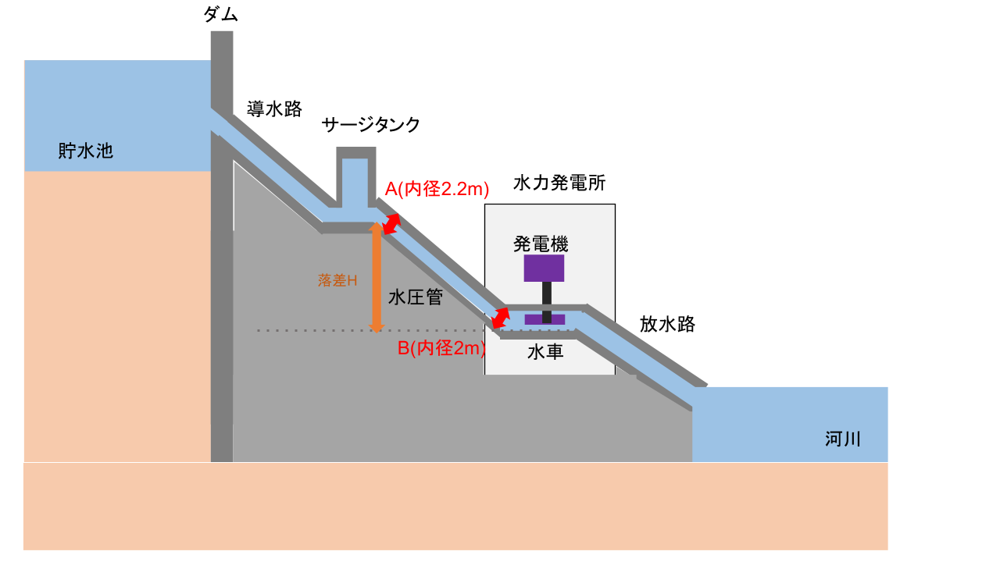

# 【電験3種・電力】水力学の計算問題の解き方

## 問題を解くのに必要な水力学の公式

- 流量
    - 流量 $Q=Av$ で計算。Aは断面積、vは水の速度。
    - 単位時間に任意の断面を追加する水量。例えば水路の流量を測定するとき、水路の断面積は決まっているので、水路を流れる水の速度を測定すれば、流量も計算できます。
- 連続の定理
    - 水管を流れる水の「流量」はどの場所でも等しくなる。
    - $A_1v_1=A_2v_2$
- ベルヌーイの定理
    - $h_1 + \frac{p_1}{\rho g}+\frac{v_1^2}{2g} = h_2 + \frac{p_2}{\rho g}+\frac{v_2^2}{2g}$
    - 水管を流れる水は、①位置エネルギー②圧力エネルギー③運動エネルギーを持っており、それらの合計は水管のどの位置でも等しい(厳密には、エネルギー損失があるため等しくはないが、電験3種の試験では無視されることが多い)。また、①位置水頭②圧力水頭③速度水頭の合計も水管のどの位置でも等しい。
- 水頭
    - 流体のもつエネルギーを水の高さの単位(m)で表したものです。つまり、流体の位置エネルギー、圧力エネルギー、運動エネルギーそれぞれをmgで割って水柱の高さに変換したものになります。それぞれ位置水頭、圧力水頭、速度水頭といいます。
- 位置水頭[m]
    - 位置エネルギーはmghなので、mgで割るとhになる。
    - 水の質量m[kg]、高さh[m]、重量加速度g[m/s^2]
- 圧力水頭 $\frac{p}{\rho g}$ [m]
    - 圧力エネルギーはm(p/ρ)なので、mgで割ると、$\frac{p}{\rho g}$になる。 水圧p[Pa]、体積V[m3]、質量m[kg]、密度ρ[kg/m^3]
- 速度水頭 $\frac{v^2}{2g}$ [m]
    - 質量m[kg]、流速v[m/s]
    - 運動エネルギーは $\frac{1}{2}mv^2$ なので、これをmgで割ると、$$\frac{v^2}{2g}$$になる。

## 参考動画

## 【例題】ベルヌーイの定理を用いた水圧管内の流速と水圧の計算

水圧管内を水が充満して流れている。断面Aの内径2.2m，流速3m/s，圧力24kPaである。
このとき，断面Aとの落差が30m，内径2mの断面Bにおける流速[m/s]と水圧[kPa]を求めよ。
重力加速度は9.8m/s2、水の密度は1000kg/m3，円周率は3.14とする。

- 流量(Q=Av)は一定なので、以下の式より流速$v_B$が求まる。

$ 
A_Av_A=A_Bv_B
$ 

$ 
(\pi r_A^2)v_A=(\pi r_B^2)v_B
$ 

$ 
v_B=\frac{(\pi r_A^2)}{(\pi r_B^2)}v_A=3.629
$ 

- ベルヌーイの定理より、圧力$p_B$が求まる。

$ 
h_A+\frac{p_A}{\rho g}+\frac{v_A^2}{2g}=h_B+\frac{p_B}{\rho g}+\frac{v_B^2}{2g}
$ 

$ 
30+\frac{24\times10^3}{1000\times 9.8}+\frac{3^2}{2\times 9.8} = 0 + \frac{p_B}{1000 \times 9.8} + \frac{3.629^2}{2\times 9.8}
$ 

$ 
p_B = 316000[Pa] = 316[kPa]
$ 