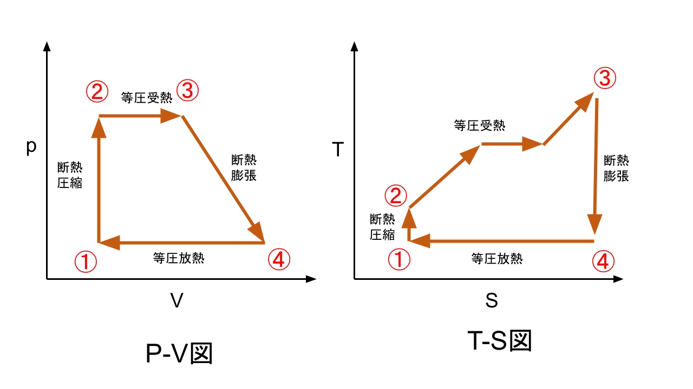
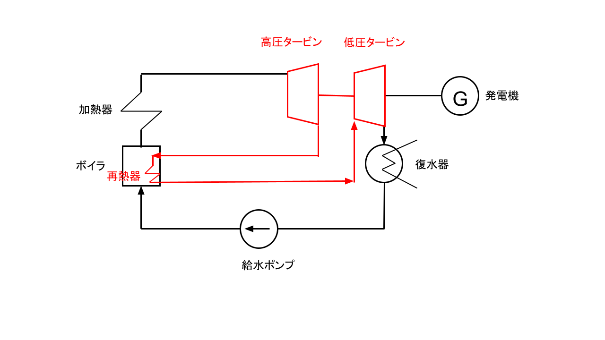
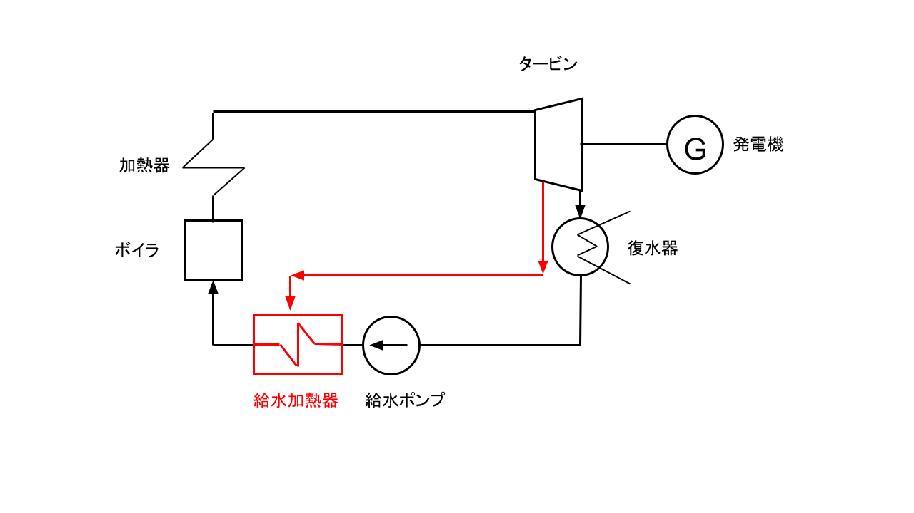

# 【電験3種】火力発電所の種別、熱力学の基礎

## 火力発電所の種別

- *汽力発電所*
    - **給水ポンプ、ボイラ、加熱器**で高温高圧の蒸気を作り、タービン内に放出して膨張させてタービンを回転させる。
    - 仕事をした低温低圧の水蒸気は水に戻って再び給水ポンプに送られる。
- *内燃力発電所*
    - **内燃機関**(ディーゼル機関等)で回転させて発電。
- *ガスタービン発電所*
    - **燃焼時のガス**でタービンを回転させて発電。
- *コンバインドサイクル発電所*
    - **汽力発電所、ガスタービン発電所を組合せて**効率よく発電。

## 熱力学の基本

- *湿り蒸気*
    - **蒸気+細かい水滴**の状態。
    - 100℃に到達しても、細かな水滴を含んだ状態がしばらく続き、温度が上がりません。
- *乾き蒸気(過熱蒸気)*
    - **蒸気のみ**の状態。加熱しつけて細かな水滴もすべて蒸発した状態。
    - 湿り蒸気の状態で蒸気タービンに放出すると、細かな水滴により部品が錆びて故障の原因となるため、乾き蒸気になるまで加熱してから放出します。
- *飽和温度(沸点)*
    - **液体が沸騰**するときの温度。**圧力が高い**と**飽和温度も高く**なります。飽和温度にある水を飽和水といいます。
- *顕熱*
    - 加熱したときに**物体の温度を上昇**させる熱。
- *潜熱*
    - **物体の温度を上昇させず**に、**水から蒸気に変わる**のに使われる熱。
- *臨界圧力*
    - 加圧して**潜熱が0**となったときの圧力。
    - 水の臨海圧力は22.12MPa。
- *臨界温度*
    - **臨界圧力に到達したときの蒸発温度**。
    - 水の臨海温度は374.1℃。
- *超臨界圧*
    - **臨界圧力を超える**圧力
- *亜臨界圧*
    - **臨界圧力より低い**圧力
- *エントロピー*
    - **物体や熱の混同度合い**を示す値。エントロピーの増加量を⊿s[J/K]、与えた熱量を⊿Q[J]、絶対温度をT[K]とすると、**$ \Delta s= \Delta \frac{Q}{T} $**となる。
- *エンタルピー*
    - **圧力一定**の条件下で、ある**物体がもつエネルギー**。
    - **吸熱するときエンタルピーは正の値**となる。
    - エンタルピーをH、物体の内部エネルギーをU、圧力をp、体積をVとすると、** $ H = U + pV $ **となる。
- *比エンタルピー*
    - **1kgあたりのエンタルピー**のこと。
- *熱力学第一法則*
    - **圧力pが一定**の条件下で気体の体積変化⊿Vのとき、気体がする仕事 $\Delta W=p \Delta V$ となる。
    - **気体が膨張**すると、**気体がする仕事は正の値**となる。

## ボイラ室の主設備

- *燃焼室*
    燃焼させた**燃料から高温ガスを生成**
- *蒸気ドラム*
    - 内部に蒸気部と水部をもち、**汽(気)水分離器**によって蒸発管からの気水を「**水分と飽和蒸気に分離**」し、蒸発管へ送水する。自然循環ボイラ、強制循環ボイラに用いられるが、貫流ボイラでは必要としない。
- *再熱器*
    - 高圧タービンで仕事をした蒸気を再加熱して、**中低圧タービン**に送るための装置。
- *節炭器(エコノマイザ)*
    - **煙道を通過する燃焼ガスの余熱**を用いて、**ボイラ給水を加熱**。熱効率向上のための設備。
- *空気予熱器*
    - **煙道を通過する燃焼ガスの余熱**を用いて、**燃焼用空気を加熱**する(※*飽和温度以上にはならない*)。ボイラの熱効率向上のための熱交換器。排ガス温度は低くなり、排ガスのロスを減少させることが可能となる。
- *安全弁*
    - **蒸気圧力が一定値を超えたとき**に弁体を開いて蒸気を放出する。過大な蒸気圧力で機器が破損する防ぐ。ボイラの使用圧力を制限する装置として**ドラム、過熱器、再熱器**などに設置される。
- *復水器*
    - 蒸気タービン内で仕事を取り出した後の**低圧の排気蒸気(湿り蒸気)を冷却**し、凝縮させて飽和水に戻す装置。
    - 復水器内部の**真空度を高く**保持してタービンの排気圧力を低くすることで、**蒸気はタービン内で十分に膨張してタービンの羽根車に大きな回転力を与える**。つまり、**熱効率の向上**を図る。
    - 熱サイクルの中で**復水器によるエネルギー損失が最も大きく**、ボイラ入熱の約半分になり、それにより海水温度は約 7 ℃上昇し、一般的な発電所ではこの値で設計されている。
- *空冷式復水器*
    - 蒸気が通過する配管の外側から送風し、冷却するタイプの復水器。
- *表面水冷式復水器*
    - 復水器内部に多数の冷却水管を設け、蒸気と冷却水管が水管表面で熱交換するタイプの復水器。
- *混合水冷式復水器*
    - 蒸気に直接冷却水を噴霧することで冷却するタイプの復水器。
- *通風装置*
    - 燃焼に必要な空気をボイラに供給し、発生した燃焼ガスをボイラから排出する。
    - 煙突だけによる**自然通風方式**と送風機を用いた**強制通風方式**がある。

## ボイラの種類

ボイラを水の循環方式によって*「自然循環ボイラ」「強制循環ボイラ」「貫流ボイラ」の3種類がある。

- *自然循環ボイラ*
    - 蒸発管と降水管内の水の比重差でボイラ水を循環させる。低圧に適しているが、ボイラの高さを高くする必要がある。冷水は比重が大きいため、蒸気ドラムから水が下がり、蒸発管では水が温められて蒸気になり、比重が小さいため上昇する。この原理によりボイラ水が自然に循環する。
- *強制循環ボイラ*
    - 降水管に循環ポンプを付けて強制的にボイラ水を循環させる。高圧にも用いることができ、ボイラの高さも低くでき、急停止ができ、水管を細く(肉厚の薄型化)できるため小型化も可能。
- *貫通ボイラ*
    - 給水ポンプで水圧を加え、節炭器→蒸発管→加熱器と貫いて流す間に過熱蒸気を発生させるため、ボイラ水と蒸気の循環がない。水と蒸気を分離しないため、蒸気ドラムがない。

## タービンの種類

- *蒸気タービン*
    - 高温高圧の蒸気の圧力で回転羽根を回す機構をもつ。
    - 熱エネルギーを運動エネルギー(機械的エネルギー)に変換する。
- *衝動タービン*
    - **羽根に蒸気がぶつかるときの衝撃力**でランナを回転させる。
- *反動タービン*
    - 羽根に蒸気が流入するときの衝撃力と、回転羽根から放出される反動力でランナを回転させる。
    - **固定羽根(静翼)で蒸気を膨張**させ、**回転羽根(動翼)に衝突する力と回転羽根(動翼)から排気**するときの力を利用している。
- *復水タービン*
    - タービンから放出された蒸気を復水器で冷やして水にすることで、体積が小さくなり真空度が高まってタービンの回転力を高める。
    - 汽力発電の熱サイクルで**最もエネルギー損失が大きい**のが**復水器**。
- *再熱タービン*
    - 使用済の蒸気を再加熱して利用することで熱効率を向上させたタービン。
- *再生タービン*
    - タービンの中間から膨張途中の蒸気の一部を取り出し、給水加熱器に送って給水を加熱することで熱効率を高めたタービン。

タービン入口蒸気は、熱落差を大きくするため、**温度と圧力が高い方が効率は良く**なる。

## 保護装置

- *蒸気止弁*
    - 蒸気タービンの回転速度が定格を超える一定値以上に上昇すると，自動的に蒸気止弁を閉じて，タービンを停止する。
- *燃料遮断装置*
    - ボイラ水の循環が円滑に行われないとき，水管の焼損事故を防止するため，燃料を遮断してバーナを消火させる。
- *安全弁*
    - 負荷の緊急遮断等で**ボイラ内の蒸気圧力が一定限度を超えたとき蒸気を放出**させて機器の破損を防ぐ。
- *トリップ装置*
    - 蒸気タービンの軸受油圧が異常低下したとき，タービンを停止させる。
- *比率差動継電器*
    - 発電機固定子巻線の内部短絡を検出・保護する。
- *調速装置*
    - 蒸気加減弁駆動装置に信号を送り、蒸気流量を調整することでタービンの回転速度制御を行う装置。
- *非常調速装置*
    - タービンの回転速度が運転中に、系統事故等で**定格回転速度の111％以上**となると作動して(※**定格回転速度以下ではない!**)、**タービンを停止**させる装置です。
- *ターニング装置*
    - **タービン停止中に高温のロータが曲がることを防止**するため、ロータを低速で回転させる装置である。

## ランキンサイクル

- *ランキンサイクル*
    - 水を加熱して高温高圧の蒸気を生成し、タービンを回転させて復水器で冷却して元の水に戻す熱サイクル
    - 
- *ランキンサイクルの状態遷移図*
    - 
        - *断熱圧縮*(①→②)
            - **給水ポンプで水に圧力をかけている**状態。
            - **圧力pは増加**するが、水は気体のように**体積Vが変化しない**(p-V図)。
            - 圧力pが高くなると、**温度Tはわずかに上昇**するが、熱の出入りがないため、**エントロピーsは不変**(T-s図)。
        - *等圧受熱*(②→③)
            - **ボイラや過熱器で加熱している**状態。
            - 加圧していないので圧力pは不変。水が蒸気になるので体積Vは膨張(p-V図)。
            - 加熱により温度Tが急激に上昇。しばらく温度が不変になっているところは、湿り蒸気(水が沸騰中)の状態なので、熱を受け取っているのでエントロピーsは増加(t-s図)。
        - *断熱膨張*(③→④)
            - **蒸気をタービン内に放出し仕事をしている**状態。
            - 膨張させて仕事をさせるため、体積Vは増加(p-V図)。
            - 高圧蒸気は低圧蒸気になるため、圧力pは低下する(p-V図)。
            - 急激に圧力が下がるので温度Tも低下するが、熱の出入りがないためエントロピーsは不変(t-s図)。
        - *等圧放熱*(④→①)
            - **復水器で蒸気を水にしている**状態。
            - 蒸気が水になるので体積Vが減少する(p-V図)。
            - 圧力pはかけていないため不変(p-V図)。
            - 温度Tはわずかに下がり（微小なので無視)、復水器によって熱を放出しているためエントロピーsは減少(T-s図)。
- 再熱サイクル
    - 高圧タービンで仕事をして温度が低下した湿り蒸気を、ボイラの再熱器で再加熱して乾き蒸気に変換し、低圧タービンで仕事をさせる熱サイクル(再加熱する点がランキンサイクルと異なる)。
    - 
- 再生サイクル
    - タービンから蒸気を抽気して給水の加熱に利用する熱サイクル(抽気する点がランキンサイクルと異なる)。
    - 
- 再熱再生サイクル
    - 再熱サイクルと再生サイクルを組み合わせたもの。
    - 高圧タービンで仕事をして温度が低下した湿り蒸気をボイラの再熱器で再加熱して乾き蒸気に変換し、低圧タービンで仕事をさせ、さらに各タービンから蒸気の一部を抽気して給水の加熱に利用します。
    - 再熱再生サイクルが最も効率がよく、大容量の汽力発電所で使われています。
    - 

①復水器から出てきた水を給水ポンプで加圧してボイラへ供給し、ボイラで飽和蒸気になる。
②ボイラから出てきた飽和蒸気は過熱器で過熱蒸気になり、高圧タービンへ送られる。
③高圧タービンで仕事をした蒸気は再熱器で再過熱される。
④再熱器から出た高温再熱蒸気は、低圧タービンへ送られ、低圧タービンで仕事をして復水器で復水に凝縮される。
⑤復水での熱損失を減少させるため、低圧タービン中段から抽気を取り出し、給水を加熱する。

## おすすめ参考動画

- 初心者向け電験三種・電力・7・汽力発電・ボイラの種類【超簡単に学ぶ！】第三種電気主任技術者
    -  
- 1-1. 蒸気タービンの原理（電力機器の原理） 
    - 

## 関連リンク

- [電験3種試験対策トップページ](../index.md)
- [トップページ](../../../index.md)