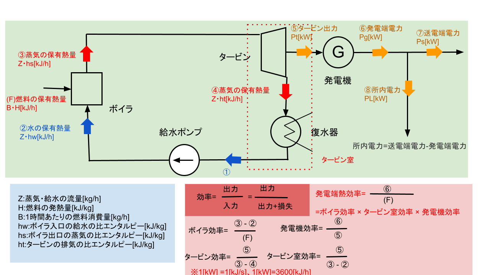

# 電験3種 火力発電所の出力に関する試験問題対策

## 火力発電の電力

- 発電端電力 $P_G$ 
    - 発電機で発電された電力
- 送電端電力 $P_S$ 
    - 外部へ送電する電力
- 所内電力 $P_L$ 
    - 発電所内で使用する電力。発電端電力PGの一部を使用するため、 $Pg = Ps + PL$ が成り立つ。
- 所内率L[%]
    - 発電端電力 $P_G$  に対する所内電力 $P_L$ の割合。
    - $L=\frac{P_L}{P_G}\times 100$及び$P_s=P_g(1-L)$ が成り立つ。

- 火力発電の各種効率[%]
    - 火力発電機の熱効率 $\eta=\frac{P_t\times 3600}{BH}$
        - 「燃料の保有熱量」と「タービンの機械出力（熱量換算値）」の比。
    - ボイラ効率 $\eta_B=\frac{Z(h_s-h_w)}{BH}$
        - 燃料の保有熱量」と「ボイラで発生した蒸気の熱量」の比。高いほど、水を効率よく蒸気に変換できたことを示す。
    - タービン効率 $\eta_t=\frac{P_t\times 3600}{Z(h_s-h_t)}$ 
        - 「タービンで消費した熱量」と「タービン出力」の比。高いほど、蒸気エネルギーを発電機の回転エネルギーに効率よく変換できたことを示す。
    - タービン室効率 $\eta_T=\frac{P_t\times 3600}{Z(h_s-h_w)}$	 
        - 「ボイラで発生した蒸気の熱量」と「タービン室の出力」の比。タービン室効率はタービンと復水器が一つのユニットとして考えています。
    - 発電機効率 $\eta_g=\frac{P_g}{P_T}$ 
        - 「タービンの出力」と「発電機の出力」の比。
    - 発電端熱効率 $\eta_p=\eta_B\eta_T\eta_G=\frac{P_g\times 3600}{BH}$ 
        - 「燃料の保有熱量」と「発電機の出力」の比。「ボイラ効率 × タービン室効率 × 発電機効率」で表すことができる。
    - 送電端効率 $\eta_s=\frac{(P_g-P_L)\times 3600}{BH} =\frac{P_s\times 3600}{BH} =\eta_p(1-L)$ 
        - 「ボイラで使用した燃料の保有熱量」と「送電端電力(発電所の出力)」の比。
    - 
    - 
- エンタルピー［KJ］
    - 熱エネルギーと仕事のエネルギーを持った物体のエネルギーを表す指標。
- 比エンタルピーh［KJ/Kg］）
    - 単位重量当たりのエンタルピー。
- 復水器の損失
    - 復水器は、蒸気（気体）を水（液体）に戻し、体積を激減させて復水器内を真空に近い状態にします。これにより、蒸気をタービンの入口から出口（復水器入口）に向けて流すことができ、熱効率が向上しますが、同時に蒸気を水に戻すために捨てられる熱量（損失）も大きくなります(最も大きなエネルギー損失が生じるのが復水器)｡つまり、復水器の損失とは「復水器の冷却水が持ち去る熱量」を意味します。
- 水器の冷却水が持ち去る熱量[kJ/s] ＝ 流量[m3/S] × 比熱[kJ/(kg・K)] × 密度[kg/m3] × 冷却水の温度上昇[K]

1 [kW⋅h] は 1 [kW] の電力で 1時間運転した時の電力量です。
また、1 [W⋅s]=1 [J] なので、1[kW⋅h]=3600[kW⋅s]=3600 [kJ]になります。

## 【例題1】送電端電力量、発電端効率の計算

定格出力350MW(所内率Lは2％) の火力発電所にて、発電機が以下表のような運転を行ったとき以下(1)(2)の値を求めよ。 
- (1)0〜24時の間の送電端電力量の値Ws[MW⋅h] 
- (2)0〜24時の間の間に発熱量 54.70[MJ/kg]の LNG （液化天然ガス）を770[t]消費したとすると、この間の発電端熱効率の値ηs[％] 

時刻|発電機出力 [MW]
--|--
0 ～ 7 時|130
7 ～ 12 時|350
12 ～ 13 時|200
13 ～ 20 時|350
20 ～ 24 時|130

【(1)の解答】
- 表より、発電端電力量Wg=5830[MW⋅h]となる。

Wg=(130×7)+(350×5)+(200×1)+(350×7)+(130×4)=5830 [MW⋅h]

- 所内率=0.02なので、発電端電力量Wgから送電端電力量Ws=5713.4[MW⋅h]と求まる。
Ws=(1−L)Wg=(1−0.02)×5830=5713.4[MW⋅h]

【(2)の解答】

題意より、
燃料消費量B=770[t]=770000[kg]
燃料発熱量H=54.70[MJ/kg]

また、発電端電力量Wg=5830[MW⋅h]なので、発電端電力(の平均)Pg=5830[MW]となる。
よって、発電端熱効率ηp=0.498(約49.8%)となる。

 $\eta_p=\frac{P_g\times 3600}{BH}=\frac{5830 \times 3600}{770000\times 54.7}=0.498$ 
 

## 【例題2】タービン出力及び海水温度

【問題】
復水器の冷却に海水を使用している以下の仕様の汽力発電所がある。復水器冷却水が持ち去る熱以外の損失は無視するものとすると、
- ①タービン出力の値 [MW] 
- ②復水器冷却水の温度上昇の値 [K] 
はいくらになるか。

パラメータ|値
--|--
復水器冷却水流量|30[m3／s]
復水器冷却水が持ち去る毎時熱量|$3.1×10^9$[kJ／h]
海水の比熱容量|4.0 [kJ／(kg⋅K) ]
海水の密度|$1.1×10^3$[kg／m3]
タービンの熱消費率
※タービン出力において1[kW・h]の電力量を得るのに消費した熱量 [kJ]|8000 [kJ／(kW⋅h)]

【(1)の解答】

- タービンの熱消費率=8000 [kJ／(kW⋅h)]より、8000[kJ]の熱量を消費すると、発電電力量1[kWh] =3600[kJ]を生み出し、残り熱量4400[kJ]の蒸気がタービンでは消費されずに復水器に送られる。
※ 1[kW]=3600[kJ／h]

- よって、「タービン出力Pt × 3600 [kJ/h] : 復水器冷却水が持ち去る毎時熱量Qo[kJ／h] = 3600 : 4400」という関係式が成立するので、関係式のQoに題意の値を入れて計算すれば、タービン出力Ptは約704MWとなる。

 $P_t = (3.1 \times 10^9) \times \frac{3600}{4400}\times {1}{3600}=704.5 \times 10^3 $

【(2)の解答】

- 1[s]当たりに持ち去る熱量Q[kJ／s] は，温度上昇を Δ [℃] とすると，
Q=mc⊿T=4.0×1.1×103×30ΔT=1.32×10^5×3600=4.752×10^8ΔT

- また、題意より復水器冷却水が持ち去る毎時熱量は$3.1×10^9$[kJ／h]なので、以下の等式から⊿Tが求まる。

4.752×10^8ΔT=3.1×10^9
ΔT=6.52[℃]・・②

## 【例題3】タービン効率、発電機効率の計算

【問題】
ある火力発電所において、蒸気タービンの使用蒸気量が100t/h、蒸気タービン出力が18MW で運転している。
また、P-V図において、点①の比エンタルピーが140kJ/kg、点②の比エンタルピーが150kJ/kg、点③の比エンタルピーが3380kJ/kg、点④の比エンタルピーが2560kJ/kgであるとき、 
- (1)タービン効率の値［%］ 
- (2)発電所の送電端電力 16MW、所内比率5%のときの発電機効率の値［%］ 
を求めよ。
- 

【(1)の解答】
- 題意より、各比エンタルピーh、蒸気・給水の流量Z、蒸気タービン出力Ptは以下のとおり。
    - ボイラ入口給水(点②)の比エンタルピーhw=150[kJ/kg]
    - ボイラ出口蒸気(点③)の比エンタルピーhs=3380[kJ/kg]
    - タービン排気(点④)の比エンタルピーht=2560[kJ/kg]
    - 蒸気・給水の流量Z=100[t/h]=100000[kg/h]
    - 蒸気タービン出力Pt=18MW=18000[kW]
- タービン効率ηtは以下のとおり79%となる。

 $\eta_t=\frac{P_t\times 3600}{Z(h_s-h_t)}\times 100 = \frac{18000 \times 3600}{100000(3380-2560)}\times 100=79$ 

【(2)の解答】
題意より、発電所の送電端電力Ps=16MW、所内比率L=0.05である。
送電端電力Ps、所内比率L、発電端電力Pgの関係式は「Ps=(1-L)Pg」なので、以下のように発電端電力Pg=16840[kW]と求まる。

 $P_s=(1-L)P_g = 16000=(1-0.05)P_g=P_g=16840$ 

よって、発電端電力Pgと蒸気タービン出力Ptがわかっていれば、発電機効率ηgの計算式に代入し、ηg=93.6%と求まる。

 $\eta_g=\frac{P_g}{P_T}\times 100=\frac{16840}{18000}\times 100=93.6$ 

## 【例題4】ボイラ効率の計算

定格出力10000kW の重油燃焼の汽力発電所がある。
この発電所が 30日間連続運転し、そのときの重油使用量は 1100[t]、送電端電力量は 5000[MW・h]であった。
この汽力発電所のボイラ効率の値［％］を求めよ。
なお、重油の発熱量は 44000[kJ/kg]、タービン室効率は47[％]、発電機効率は 98[％]、所内率は 5[％]とする。

題意より、

- 燃料消費量 $B[kg/h]=\frac{1100 \times 1000}{30 \times 24}=1527$ 
- 燃料の発熱量 $H［kJ/kg］=44000$ 
- 送電端電力量 $Ws[kWh]=\frac{5000000}{30\times 24}=6944$
- 送電端電力 $Ps[kW]=6944$
    - ※1[kWh] とは1[kW]で1時間運転した時の電力量なので、送電端電力量Ws=6944[kWh]のとき、送電端電力の平均値は6944[kW]となる(Psを求める際に、誤ってWsを3600で割らないこと)。
- 発電機効率 ηg=0.98
- 発電機効率 ηt=0.47
- 発電端出力 $Pg[kW]=\frac{P_s}{1-L}=\frac{6944}{0.95}=7309.5$
    - (Ps=(1-L)Pg、所内率5[％]=L=0.05より)

発電端熱効率ηpの公式に上記の値を代入すれば、ボイラ効率ηBは約85%と求まる。

 $\eta_p=\eta_B\eta_T\eta_g=\frac{P_g\times 3600}{BH}$ 

 $\eta_B\times 0.47 \times 0.98=\frac{7309.5 \times 3600}{1527\times 44000}$ 

 $\eta_B\times 0.46 = 0.392$ 

 $\eta_B= \frac{0.392}{0.46 }=0.852$ 

※題意の「定格出力10000kW」は計算には不要だが、送電端電力や発電端出力の計算ミスチェックには活用できる(定格出力より大きかったり、定格出力と比較して半分以下などのあまりにも小さい値になれば、計算誤りの可能性が高いため)。

## 【例題5】コンバインドサイクル発電所の効率

【問題】
排熱回収方式のコンバインドサイクル発電所において、コンバインドサイクル発電の熱効率が 48［％］、ガスタービン発電の排気が保有する熱量に対する蒸気タービン発電の熱効率が 20［％］であった。
ガスタービン発電の排気はすべて蒸気タービン発電に供給されるものとするとき、ガスタービン発電の熱効率［％］を求めよ。

【解答】
題意より、コンバインドサイクル発電効率η=0.48、蒸気タービン効率ηs=0.2なので、以下の式よりガスタービン発電効率ηg=0.35(35%)と求まる。

 $\eta = \eta_g+(1-\eta_g)\eta_s$ 

 $0.48 = \eta_g+(1-\eta_g)0.2$ 

 $\eta_g = 0.35$ 

## 【例題6】発電端熱効率、ボイラ効率の計算

【問題】
最大発電電力量 600［MW］の石炭火力発電がある。石炭の発熱量を 26400［kJ/kg］とするとき、以下(1)(2)の値を求めよ。 
- (1)日負荷率 95.0［％］で 24時間運転したとき、石炭の消費量は 4400［ｔ］であった。このときの発電端熱効率［％］はいくらか。
なお、日負荷率［％］=(平均発電電力/最大発電電力量)×100 とする。
- (2)タービン効率45.0［％］、発電機効率99.0［％］、所内比率 3.00［％］とすると、発電端効率が40.0［％］のときのボイラ効率［％］はいくらか。

【(1)の解答】

● 題意より

発電端出力(=平均発電電力)Pg=日負荷率×最大発電電力量=0.95×600000=570000
燃料消費量 $B[kg/h]=\frac{4400 \times 1000}{24}=183333$ 
燃料の発熱量 $H［kJ/kg］= 26400$ 

- よって、以下の関係式から発電端熱効率ηg=0.4239(約42.4%)と求まる。

 $\eta_g = \frac{P_g \times 3600}{BH}=\frac{570000 \times 3600}{183333\times 26400}=0.4239$ 

【(2)の解答】

- 題意より、タービン効率ηt=0.45、発電機効率ηg=0.99、発電端効率ηp=0.4なので、以下の関係式より、ボイラ効率ηB=0.898(約90%)と求まる。
(今回、題意の所内率L=0.03は計算に不要)

 $\eta_p=\eta_B\eta_T\eta_G$ 
 $0.40=\eta_B\times 0.45 \times 0.99$ 
 $\eta_B=\0.898$ 

## 【例題7】発電機の発電電力、送電端熱効率の計算

汽力発電所において、定格容量 5000［kV・A］の発電機が 9時から 22時の間に下表に示すような運転を行ったとき、発熱量 44000［kJ/kg］の重油を 14［t］消費した。この9時から 22時の間の運転について、
- (1) 発電機の発電電力［MW・h］
-  (2)送電端熱効率［％］ 
を求めよ

時刻|皮相電力[kVA]|力率[%]
--|--|--
9時〜13時|4500|遅れ85
13時〜18時|5000|遅れ90
18時〜22時|4000|進み95

【(1)の解答】
表より、発電機出力量Wg［kW・ｈ］=(4500×0.85×4)+(5000×0.90×5)+(4000×0.95×4)=53000［kW・ｈ］=53[MWh]

【(2)の解答】
- (1)より、発電機出力量Wg=53[MWh]なので、発電機出力の平均Pg=53[MW]=53000［kW］
- 題意より、所内率L=0.05なので、送電端出力Psは50350［kW］
Ps=(1-L)Pg=0.95×53000=50350

-  また、題意より、

燃料の消費量B=14[t]=14000[kg]
燃料の発熱量H=44000［kJ/kg］

なので、以下の式より、送電端熱効率ηs=0.294(約29%)となる。

 $\eta_s=\frac{P_g\times 3600}{BH}=\frac{50350\times 3600}{14000 \times 44000}=0.294$ 

 ## 参考動画

初心者向け電験三種・電力・9・汽力発電・効率【超簡単に学ぶ！】第三種電気主任技術者
 

初心者向け電験三種・電力・10・復水器損失【超簡単に学ぶ！】第三種電気主任技術者
 