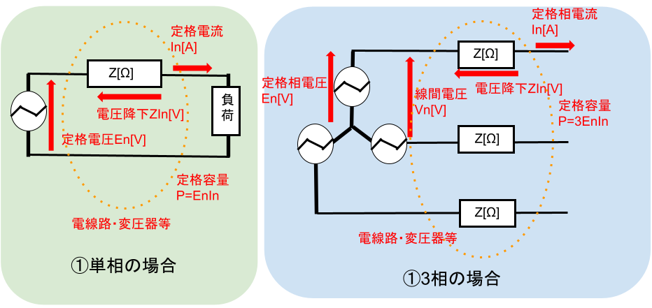
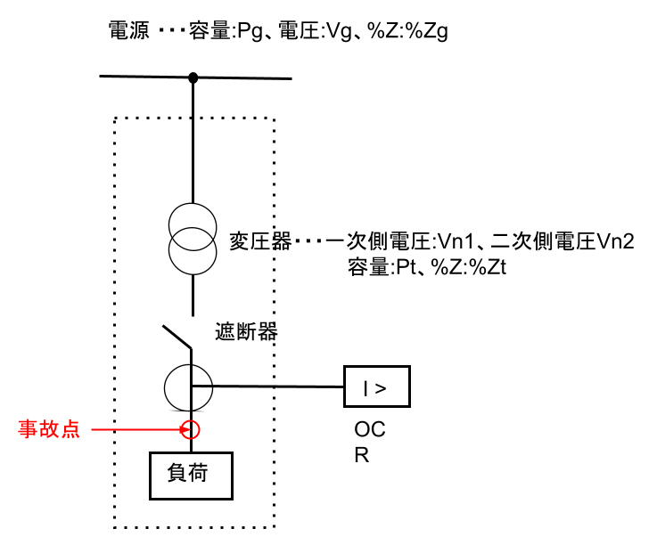
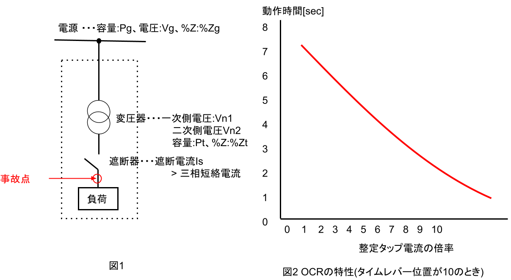
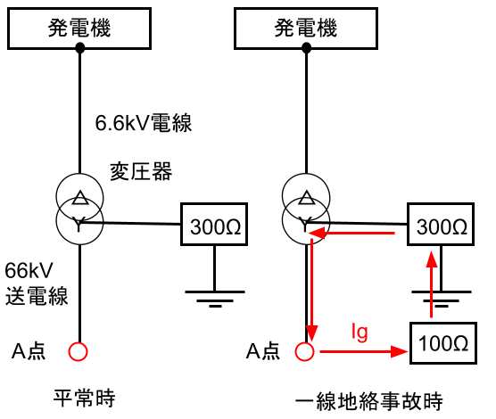
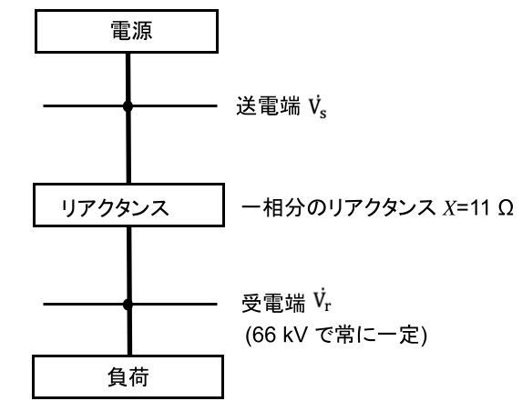

# 【電験3種・電力】%Z(パーセントインピーダンス)の仕組みと試験問題対策

## %Z(パーセントインピーダンス)とは

- %Z(パーセントインピーダンス)とは
    - %Z(パーセントインピーダンス)は、**定格電圧に対する電圧降下の割合**です。
- %Zを用いる利点
    - 電源〜負荷の間で発生する電圧降下を簡単に計算できるようになります。
    - 電圧降下が計算できると、**事故電流(地絡電流や短絡電流)を簡単に計算**でき、必要な遮断器を選定できます。
- %Zを使える条件
    - X>>>R(抵抗成分Rがリアクタンス成分Xに比べ無視できるほどに小さい)
        - **変圧器 + 配線**などは、X>>>Rとなり、%Z法が使える。
- 変圧器の%Z
    - %Zが小さいほど電圧降下が小さく、変圧器の性能はよくなるが、コストがかかる。
    - 短絡事故が発生するとより大きな電流が流れる(その分、事故電流を遮断するための遮断器もより高性能なものが必要となる)。
    - 変圧器の%Zは単純に小さいほど良いわけでなく、利用場所に応じて適切に選定します。

## 単相回路と三相回路の%Z

  

【*単相回路の%Z*】

- 定格電圧$E_n$[V]、定格電流$I_n$[A]のとき、負荷と電源の間(電線路・変圧器等)にあるインピーダンスZ[Ω]には電圧降下$ZI_n$[V]が生じます。%Z[%]は以下の計算式で求められます。

(**要暗記**)

$ \% Z = \frac{ZI_n}{E_n}\times 100 $

- 上式の両辺に$E_n$を掛けると、定格容量$P_n=E_nI_n$より、%Z[%]の計算式は以下のように整理できます。

(**要暗記**)

$ \% Z = \frac{E_n \times ZI_n}{E_n \times E_n}\times 100 = \frac{P_n Z}{E^2_n}\times 100 $

- 上式の重要なポイントとして、「**%Zと定格容量Pnは比例関係**」にあります。

【*三相回路の%Z*】

- 定格相電圧$E_n$[V]、定格相電流$I_n$[A]のとき、各相の負荷と電源の間(電線路・変圧器等)にあるインピーダンスZ[Ω]には電圧降下$ZI_n$[V]が生じます。よって、%Z[%]は以下の計算式で求められます。

(**要暗記**)

$ \% Z = \frac{ZI_n}{E_n}\times 100 $

- 上式の両辺に$3E_n$を掛けると、定格容量$P_n=3E_nI_n$より、%Z[%]の計算式は以下のように整理できます。

$ \% Z = \frac{3E_n \times ZI_n}{3E_n \times E_n}\times 100 = \frac{P_n Z}{3E^2_n}\times 100 $

- 線間電圧$V_n=\sqrt{3}E_n$より以下のように整理できます。

(**要暗記**)

$ \% Z = \frac{P_n Z}{V^2_n}\times 100 $

- 単相と違い、分母の電圧が**定格相電圧$E_n$でなく定格線間電圧$V_n$**になります。

## 三相短絡電流の計算と遮断器の選定

  

- 基準電圧$V_b$は、事故点(短絡点)の線間電圧（変圧器の定格電圧2次側）となります。

$ V_b=V_{n2}$ 

- 基準容量Pbを設定します。（任意に設定）

$ P_b=P_t$ 

- 変圧器及び電源の%Zを基準容量Pbに合わせて換算します。

(電源の%Z) $ \%Z_{gb} = \%Z_g\frac{P_b}{P_g}$ 

(変圧器の%Z) $ \%Z_{tb} = \%Z_t\frac{P_b}{P_t}$ 

- 事故点(短絡点)〜電源側までの合成％Zを計算します。通常のインピーダンスと同様、直列に接続されている場合は以下のように足し算で合成インピーダンスが求まります。

$ \%Z = \%Z_{gb} + \%Z_{tb}$ 

- 基準容量$P_b$と基準電圧$V_b$から、定格電流$I_n$を計算します。
 
$ I_n = \frac{P_b}{\sqrt{3}V_{b}}$
 
- 定格電流$I_n$が求まれば、以下の計算式で三相短絡電流$I_s$が求まります。
 
$ I_s=\frac{100I_n}{\%Z}$ 

- よって、三相短絡電流$I_s$を上回る遮断能力をもつ遮断器が必要だとわかります。

【補足】

- %Zは基準容量$P_b$に比例します。
- 例えば、変圧器の$\%Z_t=2$、定格容量$P_t=10$、基準容量$P_b=5$のとき、基準容量に換算した$\%Zb_t=2\times (5/10)=1$となります。

(電源の%Z) $ \%Z_{gb} = \%Z_g\frac{P_b}{P_g}$ 

(変圧器の%Z) $ \%Z_{tb} = \%Z_t\frac{P_b}{P_t}$ 

## 【例題1】 変圧器の三相短絡電流

【*問題*】

以下の仕様をもつ三相変圧器の一次側に77kVの電源、二次側に負荷が接続されている。
三相変圧器の一次側から見た電源の百分率インピーダンスが1.1％（基準容量20 MV⋅A）であった。
抵抗分及びその他の定数は無視するとき、三相変圧器の二次側に設置する遮断器に最低限必要な遮断電流の値[kA]を計算せよ。

- 三相変圧器の仕様
    - 定格容量:20MV⋅A
    - 一次側定格電圧:77kV
    - 二次側定格電圧:6.6kV
    - 百分率インピーダンス:10.6％（基準容量20MV⋅A）

【*解答*】

- 三相変圧器の二次側に設置する「遮断器に最低限必要な遮断電流」とは、
 

77kV電源 --- 変圧器(77kV/6.6kV) ---- 遮断器 ---- (事故点) --- 負荷
 
 
- というように、遮断器と負荷の間に事故点があったときに発生する事故電流以上となります。
- 電源と変圧器はともに基準容量が20MV⋅Aであるから、以下のように手順に従って計算すれば15kAとなります。

- 基準電圧Vbは、短絡点の線間電圧（変圧器の定格電圧2次側）となります。

$V_b=V_{n2} = 6600[V]$

- 基準容量Pbを設定します。（変圧器の容量を設定）

$P_b = P_t = 20,000,000[VA]$

- 各機器の%Zを基準容量Pbに合わせて換算します。

$\%Z_{gb} = \%Z_g\frac{P_b}{P_g}=1.1\frac{20,000,000}{20,000,000}=1.1$

$\%Z_{tb} = \%Z_t\frac{P_b}{P_t}=10.6\frac{20,000,000}{20,000,000}=10.6$

- 事故点(短絡点)〜電源側までの合成％Zを計算します。

$\%Z = \%Z_{gb} + \%Z_{tb}=1.1+10.6=11.7$

- 定格電流$I_n$を計算します。

$I_n = \frac{P_b}{\sqrt{3}V_b}=\frac{20,000,000}{\sqrt{3}\cdot 6000}=1749.5[A]$

- 三相短絡電流$I_s$を計算します。
$I_s = \frac{100I_n}{\%Z}=\frac{100\cdot 1749.5}{11.7} = 15000 [A]$

## 【例題2】 変圧器の三相短絡電流と保護リレーの動作時間

【*問題*】

  

図のように定格電圧66kVの電源から三相変圧器(仕様は以下を参照)を介して二次側に遮断器が接続された三相平衡系統がある。
三相変圧器一次側から電源側をみた%Zgは1.9％(基準容量Pt=10 MV⋅A)である。
三相短絡事故が発生したとき、過電流継電器の動作時間[s]を計算せよ。
ここで、三相変圧器二次側から事故点までのインピーダンス及び負荷は無視する。
また、過電流継電器の動作時間はOCRの仕様にある限時特性図に従い、計器用変流器の磁気飽和は考慮しない。

- 三相変圧器の仕様
    - 定格容量:7.5MV⋅A
    - 変圧比66kV／6.6kV
    - %Zt(自己容量基準):9.5％
- OCRの仕様
    - 接続場所:計器用変流器(CT、変流比は1000A／5A)の二次側
    - 整定タップ電流値:5A
    - タイムレバー位置:1

【*解答*】

- 基準容量Pbは任意に設定できるので、今回はPg=10MV⋅A基準とする。
- このとき、三相短絡電流Isは以下のとおり「6004[A]」となる。

$V_b=V_{n2} = 6600 $

$P_b = P_g = 10,000,000 $

$\%Z_{gb} = \%Z_g\frac{P_b}{P_g}=1.9\frac{10,000,000}{10,000,000}=1.9$

$\%Z_{tb} = \%Z_t\frac{P_b}{P_t}=9.5\frac{10,000,000}{7,500,000}=12.67 $

$\%Z = \%Z_{gb} + \%Z_{tb}=1.9+12.67=14.57 $

$I_n = \frac{10,000,000}{\sqrt{3}\cdot 6000}=874.8 [A] $

$I_s = \frac{100I_n}{\%Z}=\frac{100\cdot 874.8}{14.57} = 6,004 [A]$

- 題意より、CTの変流比1000A／5Aなので、三相短絡電流Isが流れたときに計器用変流器(CT)の二次側にはその1000分の5である30.02Aが流れる。
- 30.02Aは、**整定タップ電流値5Aの約6倍**である。
- よって、図2の限時特性図(タイムレバー位置10のとき)をみると、「整定タップ電流の倍率=6」のとき、「動作時間=4秒」となる。
- **タイムレバー位置1のときはこの1/10**となるので、0.4秒が動作時間となる。

## 【例題3】一線地絡電流と三相短絡電流の計算

  

【*問題*】

発電機、変圧器、公称電圧66kVで運転される送電線からなる系統がある。

①A点で100Ωの抵抗を介して一線地絡事故が発生したときの地絡電流の値[A]

②A点で三相短絡事故が発生したときの三相短絡電流の値 [A]

を求めよ。

- 中性点接地抵抗(変圧器のみに設置):300 Ω
- 発電機の容量:10000 kV⋅A
- 出力電圧:6.6 kV
- 三相短絡時のリアクタンス(自己容量ベース):25 ％
- 変圧器容量:10000 kV⋅A
- 変圧器の変圧比:6.6 kV / 66 kV
- 変圧器のリアクタンス(自己容量ベース):10 ％
- 66kV送電線のリアクタンス(10000 kV⋅A ベース):5％
- ※発電機と変圧器の間にあるインピーダンスは無視する。
- ※発電機、変圧器、送電線の抵抗は無視する。

【*解答①一線地絡電流の計算*】

- A点で一線地絡事故が発生したとき、**地絡相の相電圧は$\frac{66}{\sqrt{3}}$[kV]**になる。
- よって、一線地絡電流$I_g$は以下のようになる

$I_g=\frac{6000/\sqrt{3}}{100+300}=95[A]$

【*解答②三相短絡電流の計算*】

- A点からみた%Zは以下のとおり。

$\%Z=25+10+5=40[\%]$

- 66kV送電線の定格電流$I_n$は以下のとおり。

$I_n=\frac{P_n}{\sqrt{3}V_n}=\frac{10,000,000}{\sqrt{3}\cdot 66,000}=87.48[A]$

- 三相短絡電流$I_s$は以下のとおり。

$I_s=\frac{100}{\%Z}I_n=\frac{100}{40}87.48=219[A]$

## 【例題4】送電電力と%Z

  

【*問題*】

図のように、抵抗を無視できる一回線短距離送電線路のリアクタンスと送電電力について、以下①②の値を求めよ。

①送電線路のリアクタンスの%Zを求めよ(基準容量を100 MV⋅A、基準電圧を受電端電圧Vrとする)。
②送電電力$P_s$の値[MW]を求めよ(送電電圧$V_s$を66 kV、相差角(送電端電圧$V_s$と受電端電圧$V_r$の位相差) を30°とする)。

【*①の解答*】

- 基準容量$P_n$、基準電圧$V_n$、インピーダンスZ(1相)のとき

$\% X=\frac{P_n Z}{V_n^2}\times 100 = \frac{100\times 11}{(66\times 10^3)^2}\times 100 = 25[%]$

【*②の解答*】

$P_s=\frac{V_s V_r}{X}sin\delta = \frac{66 \times 10^3 \times 66 \times 10^3}{11}sin30 = 198[MW]$

## 参考動画

- *初心者向け電験三種・電力・22・パーセントインピーダンス【超簡単に学ぶ！】第三種電気主任技術者*
    - 

## 関連リンク

- [電験3種試験対策トップページ](../index.md)
- [トップページ](../../../index.md)