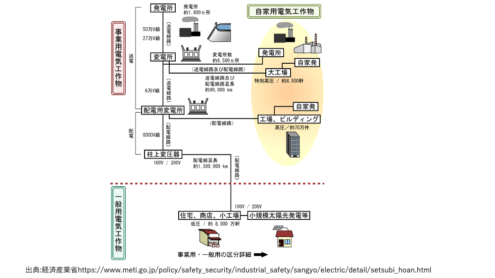

# 【電験3種・電力】送電線路に関する試験問題対策

## 送電線路と配電線路の違い

  

- 送電線路
    - **発電所〜変電所**、**変電所〜変電所**の間の電線路のこと。
- 配電線路
    - 変電所〜需要家(会社、工場、住宅)の間の電線路のこと。

## ケーブルの種類

- *CVケーブル*
    - 架橋ポリエチレンを絶縁体として使用したケーブル。
    - OFケーブルより、**絶縁体の誘電率、熱抵抗率の小ささ、常時導体最高許容温度の高さに優れ**、防災、メンテナンス、送電容量の面で有利であるため主流。
- *CVTケーブル*
    - ビニルシースを施した単心CVケーブル3条をより合わせたトリプレックス形CVケーブル。
    - 3心共通シース形CVケーブルと比較してケーブルの熱抵抗が小さいため電流容量を大きくでき、ケーブルの接続作業性が良い。
- *OFケーブル*
    - 油浸紙絶縁(絶縁体が「絶縁紙」と「絶縁油」を組み合わせたもの)を用いたケーブルで「**油通路が必要**」。
- *POFケーブル*
    - 油浸紙絶縁の線心3条をあらかじめ布設された防食鋼管内に引き入れ、絶縁油を高い油圧で充てんしたケーブル。
    - 地盤沈下や外傷に対する強度に優れ、電磁遮蔽効果が高い

## ケーブルに発生する損失

電力ケーブルの許容電流は、ケーブル導体温度がケーブル絶縁体の最高許容温度を超えない上限の電流であるため、電力ケーブル内での発生損失による発熱量、ケーブル周囲環境の熱抵抗、温度などによって決まる。

- *抵抗損*
    - 導体の抵抗で発生する損失(導体に流れる電流の2乗に比例。ジュール熱$RI^2$より)。
    - 電力ケーブルで発生する損失のうち、**最も大きい損失は抵抗損**である。
    - 直流電流と違って交流電流が流れるケーブル導体中の電流分布は、表皮効果や近接効果によって偏りが生じるため、抵抗損も増大する
    - 抵抗損の低減対策は「導体断面積を増やす」「分割導体」「素線絶縁導体の採用」など。
- *誘電体損*
    - ケーブル(コンデンサを巻いたような形状)の**絶縁体に流れる電流による損失**。
    - 絶縁体(誘電体)が劣化すると、抵抗が大きくなるため、誘電損失が増加する。
    - 交流電圧を印加した電力ケーブルでは、電圧に対して同位相の電流成分がケーブル絶縁体に流れることにより誘電体損が発生する。
    - 誘電体損は、ケーブル絶縁体の誘電率と誘電正接との積に比例して大きくなり、誘電率及び誘電正接の小さい絶縁体の採用が望ましい。
- *シース損*
    - ケーブルシース(金属)に流れる電流(循環電流、渦電流)による損失。
    - シース損の種類として、ケーブルの長手方向に金属シースを流れる電流によって発生する「**シース回路損**」、金属シース内の渦電流によって発生する「**渦電流損**」がある。
    - 渦電流損の対策は、「**導電率の低い**金属シース材の採用」など。
    - シース回路損の対策は、「**クロスボンド接地方式**の採用」など。
- *表皮効果*
    - 導体内を流れる交流電流により発生した磁界により渦電流が発生し、導体内の**電流分布が外側に集中**する現象。
    - 電線の断面積が大きいほど、渦電流も大きくなり対策が必要となる。
- *コロナ損*
    - 送電線に高電圧が印加され、「**電線表面の電界強度**」がある程度以上になると、電線からコロナ放電が発生する。
    - コロナ放電が発生するとコロナ損と呼ばれる電力損失が生じる。
    - コロナ放電の発生を抑えるために、電線の実効的な直径を大きくするために「**多導体化する**」「**線間距離を大きくする**」などの対策がある。
    - コロナ放電は、**気圧が低い**ほど生じやすい。つまり、都市部より**山間部の送電線ほど発生しやすい**。

## 導体の素材(硬銅より線、鋼心アルミより線)

- 導体の素材は、導電率は高い、引張強さが大きい、質量及び線熱膨張率が小さい、加工性及び耐食性に優れていることなどが求められます。
- 一般的に銅やアルミニウム又はそれらの合金が導体の素材として用いられ、それらの導体の導電率は、温度や不純物成分、加工条件、熱処理条件などによって異なり、**標準軟銅の導電率を100％**として比較した百分率で表されます。
送電線に用いられる「**硬銅より線**」「**鋼心アルミより線**」の比較は以下表のとおり。

項目|硬銅より線|鋼心アルミより線
--|--|--
導電率|◎(**90%台**)	|△(**60%台**)
引張強さ|△|◎
重量|△(重い)|◎(軽量)
外径(風圧荷重)|◎|△
コロナ放電|△|◎
コスト|△|◎

- *鋼心アルミより線*
    - 中心に**亜鉛めっき鋼より線**、その周囲に**硬アルミ線**(※軟アルミ線でない)をより合わせた電線であり、アルミの軽量かつ高い導電性と、鋼の強い引張強さとをもつ代表的な架空送電線である。
    - 純アルミニウムは、純銅と比較して**導電率が2/3程度**と低いですが、**比重が1/3程度と軽い**ため、電気抵抗と長さが同じ電線の場合、アルミニウム線の質量は銅線のおよそ半分になります。
- *硬銅より線*
    - 地中ケーブルの銅導体には一般に軟銅が用いられ、硬銅と比べて引張強さは小さいですが、伸びや可とう性に優れ、導電率が高いです。

## 多導体と単導体の違い

- *多導体方式*
    - 3相3線式送電線で、1相あたり電線2本以上で送電する。
    - 送電容量を増やすことができ、コロナ放電が発生しにくいが、サブスパン振動が発生したり、建設コストが増加する。
    - 1相に複数の電線を「**スペーサ**」を用いて適度な間隔に配置したものを多導体と呼ぶ。
    - 主に超高圧以上の送電線に用いられる。
    - 多導体を用いることで、電線表面の「**電位の傾きが小さく**」 なるので、「**コロナ開始電圧が高く**」 なり、送電線のコロナ損失、雑音障害を抑制できる。
    - 多導体は合計断面積が等しい単導体と比較すると、「**表皮効果が小さい**」。
    - 送電線の「**静電容量が減少**」するため、送電容量が増加し系統安定度が向上する。
- *単導体方式*
    - 3相3線式送電線で、1相あたり電線1本で送電する。

## 送電鉄塔

- ねん架
    - 送電線各相の作用インダクタンスと作用静電容量を平衡させるために、ジャンパ線を用いて電線の位置を入れ替えることで、各相の離隔距離が異なることにより生じる、三相不均衡を防ぐ方法。
- *鉄塔*
    - 一般的に**66kV以上**の架空送電線の支持物に用いられる。
- 碍子
    - 電線と支持物を絶縁するための絶縁体。絶縁性が高く耐久性にも優れた陶磁器や樹脂で作られたものがある。
- 耐塩碍子
    - ひだが深い(表面距離が長い)、漏れ電流がより流れにくい碍子。撥水性物質を塗布したり、定期的な洗浄による塩分の除去なども塩害対策として行われる。
- 架空地線
    - 鉄塔の最上部に張られる線で、直撃雷、誘導雷を防止する接地線、電磁誘導障害を軽減する役割をしている。
- 埋設地線
    - 鉄塔と大地を接続する接地線。鉄塔の接地抵抗を下げることで、落雷時の雷電流が大地へ流れ、逆フラッシオーバーを防止する。
- フラッシオーバー
    - 送電線に異常電圧が発生したり、碍子の絶縁劣化で送電線から鉄塔へ放電し、大地へと電流が流れる現象。
- 逆フラッシオーバー
    - 落雷時に碍子が絶縁破壊し、雷電流が送電線へ流れる現象。フラッシオーバーとは電流の流れる方向が逆。

## 地中送電線

- *地中送電線の利点*
    - 都市景観が保たれる。
    - 気象要因の事故が少なく、近傍の通信線に与える静電誘導，電磁誘導の影響も少ない。
    - 露出充電部が少ないので，感電や火災の危険性が低い。
- *地中送電線の欠点*
    - 建設費が高い。
    - **絶縁破壊等の事故箇所の特定が難しく**、復旧に時間がかかる(架空の場合、雷などによる一時的な絶縁破壊が多く自然回復することが多い)。
    - 放熱性が低く、同じ太さの導体でも送電容量が小さくなる。
    - ケーブルの場合静電容量が数10倍あるため、充電電流が大きい。
- 外径(風圧荷重)
    - 外径が大きいほど、風を受ける面積も大きくなるため、風圧荷重が大きくなってしまう。
- コロナ放電
    - 架空送電線は、裸電線なので、絶縁体は空気のみである。気温等により空気の絶縁性能が低下すると、裸電線の表面からがいしや金具等に対して放電が生じ、これを「コロナ放電」という。硬銅より線は、コロナ放電が発生しやすい。
- ギャロッピング
    - 電線に非対称な氷雪が付着し肥大化すると、微風振動と同様に電線の風下側にカルマン渦が生じ振動する現象。
- *がいしの塩害対策*
    - がいし表面に塩分が付着すると、**漏れ電流**が発生し、可聴雑音、電波障害、フラッシオーバの原因となる。
    - がいしの塩害対策は、塩害の少ない送電ルートの選定、がいしの絶縁性能を強化、がいしの洗浄、がいし表面への**撥水性物質の塗布**などがある。
    - 懸垂がいしの絶縁強化を図るには，がいしを**直列**に連結する個数を増やしたり、がいしの表面漏れ距離を長くする方法などがある。
    - **長幹がいし**(棒状磁器の両端に連結用金具を取り付けた形状)は、懸垂がいしに比べて雨洗効果が高く、塩害に対し絶縁性が高い。
- *微風振動*
    - 電線に対して微風が吹くと、電線の背後に空気の渦が生じて電線が上下に振動するが発生する。振動エネルギーを吸収するダンパを電線に取り付けて、この振動による電線の断線防止が図られている。
- *サブスパン振動*
    - 多導体の架空送電線において、**風速が数～20 m/s**(10m/sを超えると激しく揺れる)で発生する振動。
    - 架空電線が電線と直角方向に穏やかで一様な空気の流れを受けると、電線の背後に空気の渦が生じ，電線が上下に振動を起こすことがある
    - この振動を防止するためにダンパを取り付けて振動エネルギーを吸収させることが効果的である。
    - この振動によって電線が断線しないようにアーマロッドが用いられている。
- スペーサを用いた多導体化
    - 超高圧の架空送電線でコロナ放電の抑制に用いられている。スペーサはギャロッピングの防止にも効果的である。
- *アークホーン*
    - 架空送電線を鉄塔などに固定する絶縁体としてがいしが用いられている。アークホーンをがいしと併設し、雷撃等をきっかけに発生するアーク放電から**碍子が絶縁破壊しないよう保護**できる。
- *架空地線*
    - 架空送電線への**雷撃を防止**するために設けられている。遮へい角が小さいほど雷撃防止の効果が大きい。
    - 鉄塔又は架空地線に直撃雷があると，鉄塔から送電線へ逆フラッシオーバが起こることがある。
    - 埋設地線等により鉄塔の接地抵抗を小さくすることで、**逆フラッシオーバの抑制**が図られている。
- 架空送電線路の*線路定数*
    - 抵抗，作用インダクタンス，作用静電容量，**漏れコンダクタンス**がある。
    - 抵抗値は，表皮効果により交流のほうが増加する(周波数の増加に伴い電線導体内の電流分布が表面に偏る現象のため)。線間距離Dと電線半径rの比**D/rが大きいほど**、作用インダクタンスは大きくなり、**作用静電容量は小さくなる**。
    - 作用静電容量を無視できない中距離送電線路では，作用静電容量によるアドミタンスを 1 か所又は 2 か所にまとめる**集中定数回路**が近似計算に用いられる。
    - 送電端側と受電端側の 2 か所にアドミタンスをまとめる回路を**π形回路**という。

### 地中送電線の埋設方式

種別|直接埋設式|管路式|暗きょ式
--|--|--|--
概要|コンクリートトラフにケーブルを入れて埋設する方式|穴を空けたコンクリート内にケーブルを布設する方式|コンクリートのトンネル内にケーブルを布設する方式
工事の難易度|◎|○|◎
工費|◎|△|△
放熱性(許容電流)|◎|△|◎
保守点検|△|○|◎
備考|作業を行うために、**再度掘り返す**必要がある。**事故復旧に時間がかかる**。|ー|ガス水道や通信線の管等も共同で敷設できる。

## 交流送電と直流送電

- 直流送電系統
    - 送電線が2本で済むため、建設コストが下がる。
    - 長距離・大容量送電に有利(送電線リアクタンスなどによる発電機間の安定度の問題がないため)
    - 大地帰路電流による地中埋設物の電食や直流磁界に伴う地磁気測定への影響に注意に払う必要がある。
    - 事故電流の遮断が難しい(**交流のように零点がないため**)。
    - 地絡事故時の電流は交流送電系統より小さく、がいしの耐アーク性能が十分な場合、がいし装置からアークホーンを省略可能。
    - 交直変換装置から高調波が発生するため、**フィルタや調相設備の設置が必要**
    - 変圧器で電圧の変成ができない

## 誘導障害

- 誘導障害
    - 架空送電線と通信線路とが長距離にわたって接近交差していると、通信線路に対して電圧が誘導され、通信設備やその取扱者に危害を及ぼすなどの障害が生じる場合がある。この障害を誘導障害といい、以下の「静電誘導障害」「電磁誘導障害」の2種類ある。
    - *静電誘導障害*
        - 架空送電線路の電圧により、架空送電線路と通信線路間の**静電容量(キャパシタンス)**を介して通信線路に誘導電圧を発生させる。
    - *電磁誘導障害*
        - 架空送電線路の電流により、架空送電線路と通信線路間の**相互インダクタンス**を介して通信線路に誘導電圧を発生させる。
- 事故時の電磁誘導障害
    - 架空送電線路が十分にねん架されていれば、平常時は架空送電線路の電圧や電流によって通信線路に現れる誘導電圧は約0Vとなる。ところが、架空送電線路で地絡事故が発生すると、電圧及び電流は不平衡になり、**通信線路に誘導電圧が生じ**、誘導障害が生じる場合がある。例えば、一線地絡事故に伴う電磁誘導障害の場合，電源周波数をf、地絡電流の大きさをI、単位長さ当たりの架空送電線路と通信線路間の相互インダクタンスをM、架空送電線路と通信線路との並行区間長をLとしたとき、通信線路に生じる誘導電圧は**2πfMLI**となる。誘導障害対策では、この誘導電圧の大きさを考慮する必要がある。
- 故障点の位置標定
    - 地中送電線の故障点の位置を標定する方法はいくつかあります。最も多い事故は一線地絡事故である、主にマーレーループ法が使われるが、健全相がないと測定できないため、パルスレーダ法など他の手法が使われることもあります。主にマーレーループ法は地絡事故に、静電容量測定法は断線事故に、パルスレーダ法は地絡事故と断線事故の双方に用いられます。
    - *マーレーループ法*
        - 並行する**健全相**と**故障相(地絡相)**の2本のケーブルにおける一方の導体端部間にマーレーループ装置を接続し、他方の導体端部間を短絡してブリッジ回路を構成し、ブリッジ回路の平衡条件から故障点を標定します。なお、故障点の位置標定には、測定値と「**ケーブルのこう長**」が必要です。
    - 静電容量測定法
        - ケーブルの静電容量と長さが比例することを利用し、健全相と故障相(断線相)のケーブルの静電容量をそれぞれ測定することで故障点を標定します。なお、故障点の位置標定には、測定値と「ケーブルのこう長」が必要です。
    - パルスレーダ法
        - 故障相(地絡相、断線相)のケーブルにおける健全部と故障点のサージインピーダンスの違いを利用し、故障相のケーブルの一端からパルス電圧を入力し、同位置で故障点から反射パルスが返ってくる時間を測定することで故障点を標定します。なお、故障点の位置標定には、測定値と「ケーブル中のパルス電圧の伝搬速度」が必要です。

## フェランチ効果

フェランチ効果とは、負荷が軽い深夜帯などに、受電端電圧が送電端電圧より上昇する現象です。

## 参考動画

初心者向け電験三種・電力・27・フェランチ効果【超簡単に学ぶ！】第三種電気主任技術者
 

## 関連リンク

- [電験3種試験対策トップページ](../index.md)
- [トップページ](../../../index.md)