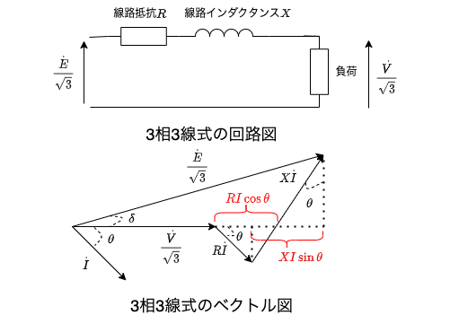

# 【電験3種・電力】配電線路に関する試験問題対策

## 高圧引込ケーブル

- [ストレスコーン](../07-1-shrink-back-stress-cone.md)
    - 遮蔽銅テープの端部へ電気力線が集中するのを防ぎ(電位傾度を緩和)、絶縁体の絶縁破壊を防止する。

## 単相2線式 配電線路の電圧降下

単相二線式の配電線路では、負荷に対して供給される線路と戻りの線路で電圧降下が発生します。
負荷の力率(遅れ力率)$cos\theta$のとき、回路図とベクトル図は以下のとおり。

 

$\dot{E}$と$\dot{V}$の位相差が十分に小さいとき、配電線路の電圧降下$\epsiron = E-V$は以下のとおり。

$ E \simeq V+2RIcos\theta + 2XIsin\theta $

$E-V=2RIcos\theta + 2XIsin\theta$

$ \epsilon = 2I(Rcos\theta + Xsin\theta) $

↑ この式は要暗記。

配電線路の線間電圧$V[V]$、線電流$I[A]$、力率$cos\theta$のとき、送電電力$P[W]$は以下のとおり。

$P=VIcos\theta$

↑ この式は要暗記。

## 3相3線式 配電線路の電圧降下

3相3線式の電線路では、荷の力率(遅れ力率)$cos\theta$のとき、一相分の等価回路とベクトル図は以下のようになる。

 

配電線路の三相分の電圧降下$\epsiron$は以下のとおり。

$ \frac{E}{\sqrt{3}} \simeq \frac{V}{\sqrt{3}}+RIcos\theta + XIsin\theta $

$\frac{E}{\sqrt{3}} - \frac{V}{\sqrt{3}}=RIcos\theta + XIsin\theta$

$ E-V = \sqrt{3}(RIcos\theta + XIsin\theta) $

$ \epsiron = \sqrt{3}(RIcos\theta + XIsin\theta) $

↑最後の式は要暗記。

配電線路の線間電圧$V[V]$、線電流$I[A]$、力率$cos\theta$のとき、送電電力$P[W]$は以下のとおり。

$P=\sqrt{3}VIcos\theta$

↑ この式は要暗記。

## 参考動画

初心者向け電験三種・電力・9・汽力発電・効率【超簡単に学ぶ！】第三種電気主任技術者
 

【カフェジカ実験室】穴あきケーブルに、高電圧メガをあててみた！
 

 ## 関連リンク

- [電験3種試験対策トップページ](../index.md)
- [トップページ](../../../index.md)